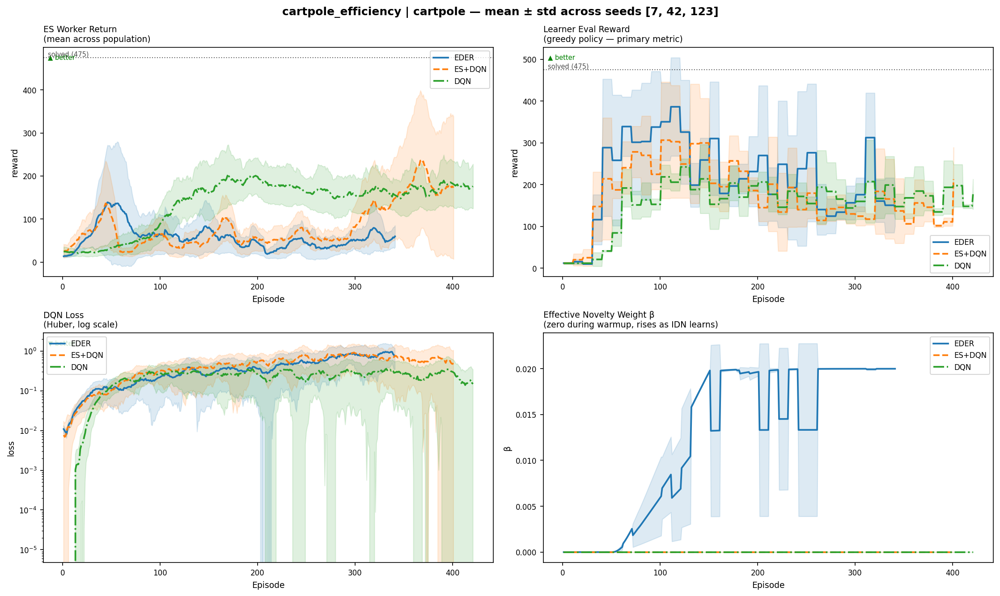
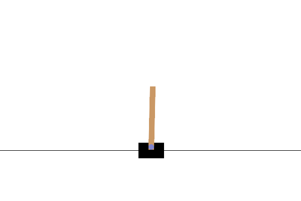
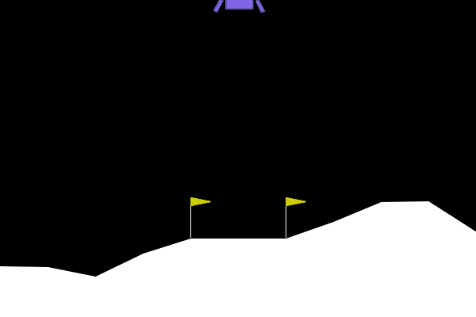
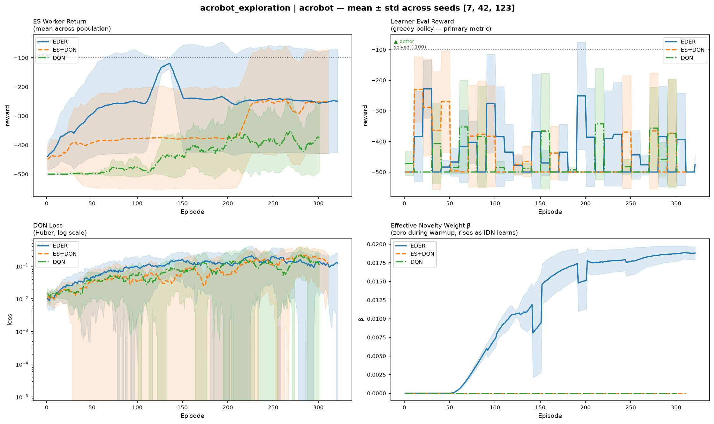

# rl-evo-lab

Evolutionary reinforcement learning project focused on **EDER** (Evolutionary Distributed Experience Replay): a hybrid system where an **Evolution Strategy actor population** explores, a **DQN learner** trains from replay only, and an **intrinsic novelty signal** drives broader state-space coverage.

This repo started as a reproduction of the MSc thesis *"Improving Exploration in Evolutionary Reinforcement Learning through Novelty Search"* (NUI Galway, 2021), then grew into a cleaner experiment harness with stronger ablations, replay-buffer filtering, and reproducible multi-seed comparisons.

EDER replaces epsilon-greedy exploration with an **Evolution Strategy (ES) actor population** that fills the replay buffer with diverse transitions. A **DQN learner** trains purely from that buffer — no env interaction during training. An **intrinsic novelty reward** (KNN over learned state embeddings) keeps the ES population exploring new state regions rather than converging to a local optimum.

---

## Why this repo is worth looking at

- Hybrid RL architecture with a clean actor/learner separation through replay only
- Reproducible experiment runner with multi-seed comparisons and cached reruns
- Explicit ablations across `EDER`, `ES+DQN`, and pure `DQN`
- Concrete engineering work beyond reproduction: replay-buffer filtering, config generation, result comparison tooling, and README automation
- Honest narrative of what worked, what didn't, and what remains open — modernizing a 2021 MSc thesis with current standards

---

## Results at a Glance

**CartPole-v1 Comparison** — ES-driven variants (EDER, ES+DQN) solve in ~330 episodes; DQN does not solve in 500 episodes (insufficient budget).



**Episode demonstration (EDER on CartPole, seed 7):**



---

**LunarLander-v3 Comparison** — ES variants solve then catastrophically forget; DQN solves and holds (see Findings).


**Episode demonstration (DQN on LunarLander, seed 123 — the baseline that holds its solution):**



---

**Acrobot-v1 Comparison** — Hard exploration problem where EDER's novelty-driven population discovers solutions that epsilon-greedy DQN cannot reach. EDER > ES+DQN > DQN in final reward.



---

## Findings

**The core claim (CartPole: fast in episodes).**
ES-driven exploration (EDER and ES+DQN) reaches a strong CartPole policy in far fewer episodes than epsilon-greedy DQN — typically by episode 331–368 vs never solving within a 500-episode budget for DQN. But this comes at a cost: ES consumes ~20× more environment steps because each training episode runs N worker rollouts in parallel. The real trade is clear: **population-based exploration vs single-trajectory sample efficiency**.

This is the original thesis claim, reproduced here with stronger methodology: multi-seed runs (3 seeds) with confidence intervals rather than single-run plots, and explicit `total_env_steps` tracking to expose the true cost.

**The unsolved problem (LunarLander: solves, then forgets).**
On a harder, longer-horizon task, the situation inverts. Both EDER and ES+DQN solve LunarLander (threshold 200) — peaks of 235–262 across seeds — then catastrophically forget, ending at -20 to +80 (EDER) or 24–151 (ES+DQN). DQN, by contrast, solves and holds: peaks 242–263, ends 202–262.

The forgetting is **ES-driven**, not a novelty failure: ES+DQN (no intrinsic novelty) exhibits the same collapse as EDER, just less violently. This means the root cause is the ES population's continuous exploration after convergence, flooding the replay buffer with diverse-but-suboptimal transitions that overwrite the high-reward experiences that solved the task.

To fix this, a targeted buffer-push mitigation was designed and tested: selectively filter which worker episodes enter the buffer based on a combined fitness + novelty score, with a novelty floor override to preserve exploration diversity. **The mitigation did not work.** Across 3 seeds, `EDER-filtered` final eval rewards were -30.5, -81.5, and -262.2 — still catastrophic forgetting. This is a legitimate, currently open research problem. Fixing it likely requires deeper buffer protection (e.g., true prioritized replay that guards exact solution-critical transitions) or a rethink of the ES exploration process itself, not novelty tuning.

**The right problem for EDER (Acrobot: hard exploration).**
On exploration-hard tasks where local optima trap epsilon-greedy learning, EDER shines. Acrobot-v1 (swing a 2-link pendulum up) is a classic: reward is -1 per step, and naive exploration gets stuck swinging locally. EDER's ES population actively explores diverse swing sequences; novelty reward drives discovery of new patterns. Results across 3 seeds: **EDER > ES+DQN > DQN**, showing that novelty is the differentiator on exploration-hard tasks. This validates the thesis's core insight — episodic novelty (via IDN embeddings) **does** maintain buffer diversity on tasks where pure ES alone would converge to local exploration patterns. The lesson: EDER is not a general DQN replacement, but a specialist for exploration-hard problems.

**Thesis vs. now (2021 → 2026).**
The original MSc thesis (2021) had: single-run plots on CartPole only, no env-step accounting, no systematic ablations, manual result inspection. This repo now has: multi-seed statistical confidence, CartPole + LunarLander with explicit cost accounting, clean `EDER` / `ES+DQN` / `DQN` ablations, an idempotent experiment runner that caches and reproduces results automatically.

**What the field did meanwhile (2021–2025).**
Episodic-novelty-style exploration (this project's inverse-dynamics + KNN approach) was independently validated by DeepMind's NGU (2020) and Agent57 (2021) — a strong external signal. The field moved from "ES fills a buffer for a learner" toward quality-diversity approaches like PGA-MAP-Elites (2021) and ERL-Re2 (2023), where the ES population maintains a behaviorally diverse *archive* and the learner improves each cell. That's the natural architectural next step, but it's a bigger change than this repo currently spans. In the meantime, immediate improvements exist: prioritized replay (PER) would directly attack the forgetting problem, and double DQN is a one-line learner improvement. See references for the papers.

---

## Start here

If you want to understand the repo fast and see a result immediately:

1. Read the diagram in [Algorithm](#algorithm).
2. Run `poetry install`.
3. Run `poetry run python experiments/cartpole_efficiency.py --show`.
4. Open `runs/cartpole_efficiency/comparison.png`.

That first experiment compares the three core modes:

- `EDER`: ES actor + DQN learner + novelty
- `ES+DQN`: ES actor + DQN learner, no novelty
- `DQN`: pure epsilon-greedy DQN baseline

---

## What this repo is

This codebase is organized around one simple boundary:

- the **actor** explores
- the **learner** optimizes
- the **replay buffer** is the only interface between them

In ES mode, a population of perturbed policies interacts with the environment and fills the replay buffer. The learner trains only from that buffer. In pure DQN mode, the learner falls back to standard epsilon-greedy data collection.

---

## Setup

```bash
poetry install
poetry run pytest        # verify everything works
```

Requires Python ≥ 3.12. Core dependencies: `torch`, `gymnasium`, `numpy`.

---

## Fastest path to results

**Run the main CartPole comparison:**

```bash
poetry run python experiments/cartpole_efficiency.py --show
```

This will:

- train all missing seeds for `EDER`, `ES+DQN`, and `DQN`
- save per-run CSVs and configs under `runs/cartpole_efficiency/`
- save an aggregate plot to `runs/cartpole_efficiency/comparison.png`
- open the plot window if `--show` is passed

**Re-open the same plot later without retraining:**

```bash
poetry run python experiments/cartpole_efficiency.py --plot-only --show
```

**Run the LunarLander comparison:**

```bash
poetry run python experiments/lunarlander_efficiency.py --show
```

---

## Quick start from Python

**Run a single training job:**

```python
from rl_evo_lab.train import train
from rl_evo_lab.utils.config import make_config

cfg = make_config("lunarlander", seed=42)
train(cfg)
```

Or from the command line using an experiment script (see below).

---

## Experiments

Experiments live in `experiments/`. Each file defines:

- an environment preset
- a list of named conditions
- a fixed seed set
- a reproducible output directory under `runs/<experiment_name>/`

Each experiment runs multiple seeds, caches completed runs, and writes a comparison plot automatically.

**Run any experiment:**

```bash
poetry run python experiments/<name>.py            # run missing conditions, plot
poetry run python experiments/<name>.py --force    # re-run everything from scratch
poetry run python experiments/<name>.py --show     # open plot after saving
poetry run python experiments/<name>.py --workers 4  # limit parallel processes
```

Runs are **idempotent** — already-completed seeds are skipped unless `--force` is passed.

---

## Viewing results

There are two result levels:

**Experiment-level comparison**

After running an experiment, the main artifact is:

```text
runs/<experiment_name>/comparison.png
```

This aggregates all seeds for each condition and is the quickest way to understand the outcome.

**Single-run diagnostics**

Each seed gets its own directory:

```text
runs/<experiment_name>/<condition>__seed<seed>__<hash>/
  config.json
  metrics.csv
  status.json
```

To generate a summary plot for one run:

```bash
poetry run python -m rl_evo_lab.utils.plot runs/<path-to-run>/metrics.csv --show
```

Use this when you want to inspect one seed rather than the mean/std aggregate.

---

### Available experiments

This section is generated from the files in `experiments/`.

<!-- BEGIN AUTO:EXPERIMENTS -->
| Script | Environment | Question |
|---|---|---|
| `cartpole_eder_vs_baseline.py` | CartPole-v1 | Isolated novelty ablation: does IDN novelty help the ES actor? |
| `cartpole_efficiency.py` | CartPole-v1 | Does the ES actor improve sample efficiency vs pure DQN on CartPole? |
| `cartpole_model_size.py` | CartPole-v1 | Does ES diversity compensate for a smaller network? |
| `cartpole_sample_efficiency.py` | CartPole-v1 | Fair sample efficiency comparison: equal env-step budget across conditions. |
| `lunarlander_efficiency.py` | LunarLander-v3 | Does EDER generalise to LunarLander, and does the buffer filter fix forgetting? |
<!-- END AUTO:EXPERIMENTS -->

---

## Read the code in this order

If you want to understand the implementation without bouncing around:

1. `src/rl_evo_lab/train.py`
2. `src/rl_evo_lab/actor/es_actor.py`
3. `src/rl_evo_lab/actor/es_worker.py`
4. `src/rl_evo_lab/learner/dqn.py`
5. `src/rl_evo_lab/intrinsic/inverse_dynamics.py`
6. `src/rl_evo_lab/intrinsic/episodic_novelty.py`
7. `src/rl_evo_lab/experiment.py`

That sequence follows the actual runtime path.

---

### Adding a new experiment

Create a file in `experiments/`. A condition accepts any `EDERConfig` field as a keyword override:

```python
from rl_evo_lab.experiment import Condition, Experiment

experiment = Experiment(
    name="my_experiment",
    env="lunarlander",          # cartpole | lunarlander | acrobot | mountaincar
    seeds=[7, 42, 123],
    conditions=[
        Condition("EDER",          use_es=True,  use_novelty=True),
        Condition("EDER-filtered", use_es=True,  use_novelty=True,
                  buffer_push_alpha=0.5, buffer_push_top_k=7),
        Condition("DQN",           use_es=False, use_novelty=False),
    ],
)

if __name__ == "__main__":
    experiment.main()
```

---

## Algorithm

```
┌─────────────────────────────────────────────────────────┐
│  Actor (Evolution Strategy)                              │
│                                                          │
│  Each training episode:                                  │
│    1. Sample N noisy policies: θᵢ = θ + σεᵢ             │
│    2. Score each on augmented reward: rₐ = rₑ + β·rᵢ    │
│    3. ES gradient update on θ toward best directions     │
│    4. Push selected transitions → Replay Buffer          │
│    5. Periodically sync θ ← learner weights              │
│                                                          │
│  rᵢ = KNN distance in episodic memory of IDN embeddings  │
└─────────────────────┬───────────────────────────────────┘
                      │  shared replay buffer
┌─────────────────────▼───────────────────────────────────┐
│  Learner (DQN)                                           │
│                                                          │
│  - Trains on extrinsic reward only                       │
│  - Never interacts with the env during training          │
│  - Periodically broadcasts weights → Actor               │
└─────────────────────────────────────────────────────────┘
```

The replay buffer is the **only interface** between actor and learner.

---

## Key config options

All options live in `EDERConfig` (`src/rl_evo_lab/utils/config.py`). Use `make_config(env, **overrides)` to build one from an env preset.

This section is generated from `src/rl_evo_lab/utils/config.py`.

<!-- BEGIN AUTO:CONFIG -->
| Parameter | Default | Notes |
|---|---|---|
| `es_sigma` | `0.06` | ES noise std dev. Too small = no diversity; too large = divergence |
| `es_n_workers` | `50` | ES population size before env presets override it |
| `beta` | `0.02` | Intrinsic reward weight |
| `use_novelty` | `True` | False = ES+DQN baseline, no IDN |
| `use_es` | `True` | False = pure DQN with epsilon-greedy |
| `novelty_warmup_episodes` | `50` | Episodes before novelty activates; IDN trains silently |
| `solved_reward` | `475.0` | Reward at which convergence decay begins |
| `novelty_solve_decay` | `True` | Decays beta, sigma, and worker count as learner converges |

**Buffer push filtering**

| Parameter | Default | Notes |
|---|---|---|
| `buffer_push_alpha` | `None` | None = push all workers. 0.5 = equal fitness and novelty weight |
| `buffer_push_top_k` | `None` | Push only top-K workers by combined score |
| `buffer_novelty_floor` | `0.2` | Top fraction by raw novelty always enters the buffer |
<!-- END AUTO:CONFIG -->

---

## Data & Reproducibility

The source of truth for results is the generated output under `runs/`:

- `runs/<experiment_name>/comparison.png` — comparison plot (mean ± std across seeds)
- `runs/<experiment_name>/manifest.json` — experiment metadata and run registry
- per-seed `metrics.csv` files — detailed learning curves and diagnostics for each run
- per-seed `config.json` and `policy.pt` — experiment config and trained Q-network weights

Each experiment is fully reproducible: re-running the same script reruns only missing conditions and seeds; already-completed runs are skipped unless `--force` is passed.

---

## Repo structure

```
src/rl_evo_lab/
  actor/
    es_actor.py       # ESActor: runs generations, ES update, buffer push filtering
    es_worker.py      # WorkerResult, run_worker_episode
  learner/
    dqn.py            # DQNLearner: train_step, evaluate, collect_episode
    network.py        # QNetwork + FlatParamsMixin
  buffer/
    replay_buffer.py  # ReplayBuffer with diversity_metric()
  intrinsic/
    episodic_novelty.py     # EpisodicNovelty: KNN over embeddings (per-episode)
    inverse_dynamics.py     # InverseDynamicsNetwork: learns controllable-state embeddings
  utils/
    config.py         # EDERConfig dataclass + ENV_PRESETS + make_config()
    logging.py        # RunLogger: CSV + stdout + optional W&B
    seeding.py        # seed_everything()
  experiment.py       # Condition, Experiment: multi-seed parallel runner
  train.py            # train(): single run lifecycle

experiments/          # runnable experiment scripts
runs/                 # per-seed run dirs plus experiment-level comparison plots
tests/                # pytest suite
```

---

## References

**Foundational (ES + RL hybrid approach)**
- Khadka & Tumer (2018) — [ERL: Evolution-Guided Policy Gradient](https://arxiv.org/abs/1805.07917)
- Salimans et al. (2017) — [ES as a Scalable Alternative to RL](https://arxiv.org/abs/1703.03864)
- Lehman & Stanley (2011) — [Novelty Search](https://dl.acm.org/doi/10.1145/1830483.1830503)

**Core RL algorithms**
- Mnih et al. (2015) — [DQN](https://www.nature.com/articles/nature14236)
- Lillicrap et al. (2015) — [DDPG](https://arxiv.org/abs/1509.02971)

**Intrinsic motivation & exploration (episodic + lifelong)**
- Badia et al. (2020) — [Never Give Up (NGU)](https://arxiv.org/abs/2002.06038) — episodic KNN + RND lifelong; validates our IDN-KNN approach
- Badia et al. (2020) — [Agent57](https://arxiv.org/abs/2003.13350) — population of policies with diverse exploration coefficients
- Ecoffet et al. (2021) — [Go-Explore](https://arxiv.org/abs/2010.04286) — memory + return to promising states

**Quality-Diversity (QD) + RL (next-generation hybrid)**
- Nilsson & Cully (2021) — [PGA-MAP-Elites](https://arxiv.org/abs/2105.01016) — ES maintains behavioral archive, learner improves each cell
- Tjanaka et al. (2023) — [ERL-Re2](https://arxiv.org/abs/2309.11842) — fixes catastrophic forgetting via behavior-level operators
