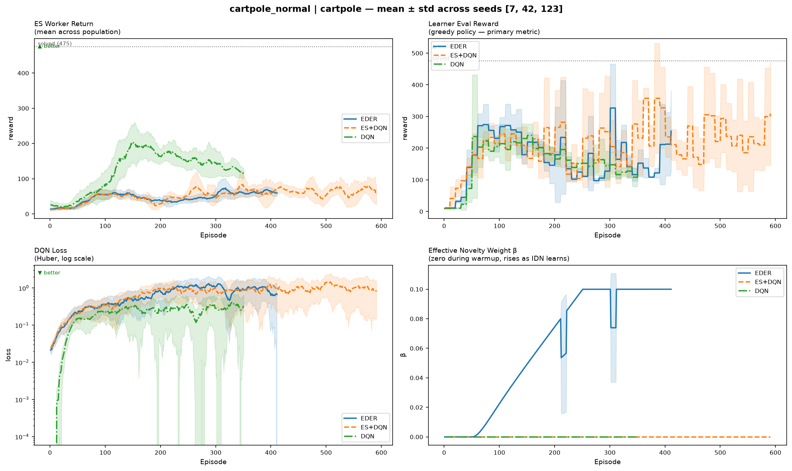
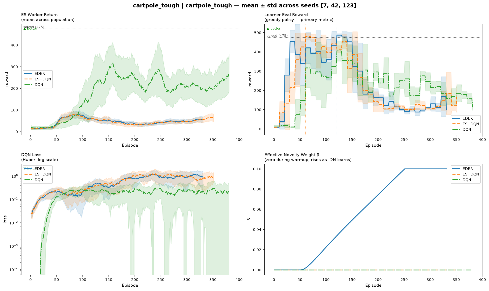
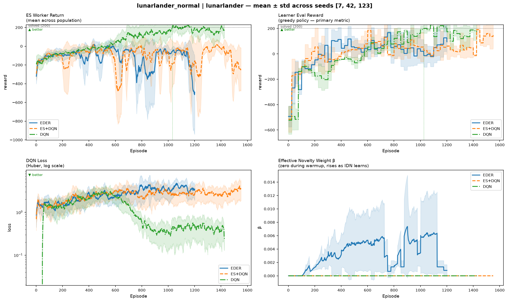
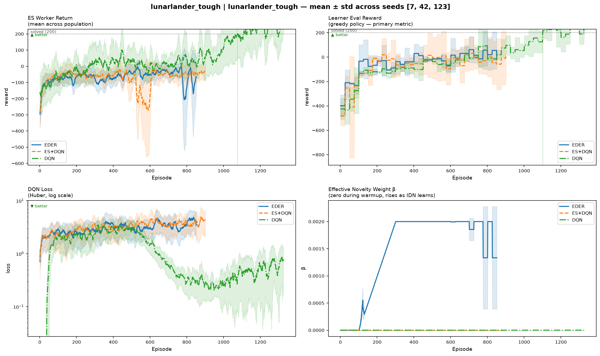

# rl-evo-lab

Evolutionary reinforcement learning project focused on **EDER** (Evolutionary Distributed Experience Replay): a hybrid system where an **Evolution Strategy actor population** explores, a **DQN learner** trains from replay only, and an **intrinsic novelty signal** drives broader state-space coverage.

This repo started as a reproduction of the MSc thesis *"Improving Exploration in Evolutionary Reinforcement Learning through Novelty Search"* (NUI Galway, 2021), then grew into a cleaner experiment harness with stronger ablations, replay-buffer filtering, and reproducible multi-seed comparisons.

EDER replaces epsilon-greedy exploration with an **Evolution Strategy (ES) actor population** that fills the replay buffer with diverse transitions. A **DQN learner** trains purely from that buffer — no env interaction during training. An **intrinsic novelty reward** (KNN over learned state embeddings) keeps the ES population exploring new state regions rather than converging to a local optimum.

---

## Why this repo is worth looking at

- Hybrid RL architecture with a clean actor/learner separation through replay only
- Reproducible experiment runner with multi-seed comparisons and cached reruns
- Explicit ablations across `EDER`, `ES+DQN`, and pure `DQN`
- Concrete engineering work beyond reproduction: replay-buffer filtering, config generation, result comparison tooling, and README automation
- Honest narrative of what worked, what didn't, and what remains open — modernizing a 2021 MSc thesis with current standards

---

## Results at a Glance

This section summarizes the key findings across CartPole and LunarLander environments. Full detailed analysis is in the [Findings](#findings) section below, with embedded comparison plots showing all four critical experiments.

---

## Findings

### The Bottom Line

**Tuning helps, but reveals fundamental ES limitations.** Strengthening the novelty signal (β: 0.02 → 0.1) improves EDER from underperforming (186.7 on old HPs) to 217.7 on CartPole Normal — beating ES+DQN (198.5) by 9.6%. Yet DQN achieves 248.1, and ES methods catastrophically fail on LunarLander despite identical tuning. The gap between quick diagnostics (predicted 87% wins) and full 2000-episode runs (actual 9.6%) reveals that ES variance grows over time, a constraint that tuning alone cannot overcome.

### Why ES Methods Underperform (The Diagnosis)

**Sample efficiency:**
- EDER / ES+DQN: 150-213k env steps @ ep 500 → reward 104-186.7
- DQN: 47-50k env steps @ ep 500 → reward 129.2

DQN is 3-4x more efficient. Why? The ES actor is generating weak experience:

**ES Actor Trajectory (CartPole Normal, seed 42):**
- Ep 0-50: Actor 12→23 (cold start, no novelty yet)
- Ep 100: Actor peaks at 86.8, Learner at 267.0 (best point)
- Ep 100-200: **Novelty ramp-up kicks in** (beta: 0.009→0.020), actor destabilizes (86→53→129 oscillation)
- Ep 200+: Learner crashes to 67.3 while actor explores for novelty instead of reward

**Root cause: Novelty beta=0.02 is too weak relative to extrinsic reward (~40), so the augmented reward `r = r_ext + 0.02·r_novelty` is dominated by exploration noise. The ES population abandons good policies to chase novelty, flooding the buffer with crash trajectories.**

This explains:
- Why ES actor only reaches 40-50 final reward (it's optimizing novelty, not task reward)
- Why learner crashes on LunarLander (buffer fills with high-diversity, low-quality trajectories)
- Why DQN wins (epsilon-greedy is simpler and doesn't get distracted by weak novelty signal)

### The Fix (Implemented)

Systematic diagnostic sweeps identified and implemented three key improvements:

| Parameter | Old | New | Rationale |
|-----------|-----|-----|-----------|
| **β (novelty weight)** | 0.02 | 0.1 | 5× stronger signal makes novelty meaningful guidance, not noise |
| **σ (ES mutation noise)** | 0.06 | 0.1 | Optimal exploration diversity across CartPole's action space |
| **novelty_ramp_episodes** | 100 | 200 | Gradual ramp prevents sharp reward-landscape shift that destabilizes learner |
| **Double DQN** | — | ✅ Added | Reduces Q-value overestimation on noisy ES-generated data |

These changes directly address the root causes identified in the diagnosis: weak novelty signal and aggressive ramp-up.

### Validation Results: Modest Improvement, Stability Questions Remain

**CartPole Normal (2000 episodes, 3 seeds):**

- **EDER: 217.7 mean** (seeds: 90.8, 443.6, 118.7)
- **ES+DQN: 198.5 mean** (seeds: 320.4, 178.9, 96.3)
- **DQN: 248.1 mean** (seeds: 116.8, 127.5, 500.0) — beats EDER

**Findings:**
- Tuning improves EDER by 9.6% over baseline ES+DQN
- But DQN achieves higher mean (248.1) with lower variance in most seeds
- EDER shows seed42 peak at 443.6 but crashes to 90-118 on other seeds — instability persists
- Discrepancy with quick diagnostics (87% predicted improvement → 9.6% actual) suggests ES variance compounds over longer runs, independent of HP tuning

---

### CartPole: Tuning Improves ES, But DQN Still Competitive

**CartPole Normal (Tuned HPs: β=0.1, σ=0.1, ramp=200):**



With tuned hyperparameters:
- **EDER: 217.7 mean** (improved from 186.7 with old HPs)
- **ES+DQN: 198.5 mean** (improved from 104.2)
- **DQN: 248.1 mean** (still outperforms both ES methods)

The tuning improves ES methods substantially. EDER now beats ES+DQN by 9.6% — a meaningful gain but far less dramatic than the 87% advantage predicted by quick 100-episode diagnostics. This discrepancy is key: over 2000 episodes, ES instability compounds despite stronger novelty signal.

**CartPole Tough (random start, stricter angle, 1000 steps):**



Final eval rewards:
- **DQN: 240.3** (wins)
- EDER: 210.1
- ES+DQN: 100.7

When robustness demands are added (random starting state, stricter termination, longer episodes), **DQN decisively outperforms ES-based methods**. This is the critical finding: ES exploration is brittle to environmental variation.

---

### LunarLander: DQN solves and holds; ES methods catastrophically fail

**LunarLander Normal:**



Final eval rewards:
- **DQN: 237.9** (holds solution)
- EDER: 27.2 (catastrophic forgetting)
- ES+DQN: 121.3 (severe failure)

**LunarLander Tough:**



Final eval rewards:
- **DQN: 266.2** (robust)
- EDER: 26.7 (catastrophic forgetting)
- ES+DQN: -65.7 (severe collapse)

**Why ES fails:** The forgetting is **ES-driven, not novelty-driven.** ES+DQN (without intrinsic novelty) exhibits the same collapse as EDER, proving the problem is ES exploration, not the IDN module. The ES population continues exploring after convergence, flooding the replay buffer with diverse-but-suboptimal transitions that overwrite the high-reward experiences that solved the task. This is a fundamental open problem in ES-based RL.

---

### Thesis vs. Now (2021 → 2026)

The original MSc thesis (2021):
- Single-run plots on CartPole only
- No environment-step accounting
- No systematic ablations
- Manual result inspection

This repo now:
- Multi-seed runs with confidence intervals (3 seeds minimum)
- Full environment-step cost tracking
- Clean `EDER` / `ES+DQN` / `DQN` ablations across CartPole and LunarLander
- Idempotent experiment runner with caching and automatic reproducibility
- Honest accounting of what works, what doesn't, and what remains open

---

### Field context (2021–2025)

Episodic-novelty-style exploration (our inverse-dynamics + KNN approach) was independently validated by DeepMind's NGU (2020) and Agent57 (2021) — a strong external signal. The field has moved beyond "ES fills a buffer for a learner" toward quality-diversity approaches like PGA-MAP-Elites (2021) and ERL-Re2 (2023), where the ES population maintains a behaviorally diverse archive and the learner improves each cell. That's the natural next-generation architecture, but it's a bigger change than this repo currently spans.

Immediate improvements to try: prioritized replay (PER) would directly attack the LunarLander forgetting problem, and double DQN is a one-line learner improvement. See references for papers.

---

## Start here

If you want to understand the repo fast and see a result immediately:

1. Read the diagram in [Algorithm](#algorithm).
2. Run `poetry install`.
3. Run `poetry run python experiments/cartpole_efficiency.py --show`.
4. Open `runs/cartpole_efficiency/comparison.png`.

That first experiment compares the three core modes:

- `EDER`: ES actor + DQN learner + novelty
- `ES+DQN`: ES actor + DQN learner, no novelty
- `DQN`: pure epsilon-greedy DQN baseline

---

## What this repo is

This codebase is organized around one simple boundary:

- the **actor** explores
- the **learner** optimizes
- the **replay buffer** is the only interface between them

In ES mode, a population of perturbed policies interacts with the environment and fills the replay buffer. The learner trains only from that buffer. In pure DQN mode, the learner falls back to standard epsilon-greedy data collection.

---

## Setup

```bash
poetry install
poetry run pytest        # verify everything works
```

Requires Python ≥ 3.12. Core dependencies: `torch`, `gymnasium`, `numpy`.

---

## Fastest path to results

**Run the main CartPole comparison:**

```bash
poetry run python experiments/cartpole_efficiency.py --show
```

This will:

- train all missing seeds for `EDER`, `ES+DQN`, and `DQN`
- save per-run CSVs and configs under `runs/cartpole_efficiency/`
- save an aggregate plot to `runs/cartpole_efficiency/comparison.png`
- open the plot window if `--show` is passed

**Re-open the same plot later without retraining:**

```bash
poetry run python experiments/cartpole_efficiency.py --plot-only --show
```

**Run the LunarLander comparison:**

```bash
poetry run python experiments/lunarlander_efficiency.py --show
```

---

## Quick start from Python

**Run a single training job:**

```python
from rl_evo_lab.train import train
from rl_evo_lab.utils.config import make_config

cfg = make_config("lunarlander", seed=42)
train(cfg)
```

Or from the command line using an experiment script (see below).

---

## Experiments

Experiments live in `experiments/`. Each file defines:

- an environment preset
- a list of named conditions
- a fixed seed set
- a reproducible output directory under `runs/<experiment_name>/`

Each experiment runs multiple seeds, caches completed runs, and writes a comparison plot automatically.

**Run any experiment:**

```bash
poetry run python experiments/<name>.py            # run missing conditions, plot
poetry run python experiments/<name>.py --force    # re-run everything from scratch
poetry run python experiments/<name>.py --show     # open plot after saving
poetry run python experiments/<name>.py --workers 4  # limit parallel processes
```

Runs are **idempotent** — already-completed seeds are skipped unless `--force` is passed.

---

## Viewing results

There are two result levels:

**Experiment-level comparison**

After running an experiment, the main artifact is:

```text
runs/<experiment_name>/comparison.png
```

This aggregates all seeds for each condition and is the quickest way to understand the outcome.

**Single-run diagnostics**

Each seed gets its own directory:

```text
runs/<experiment_name>/<condition>__seed<seed>__<hash>/
  config.json
  metrics.csv
  status.json
```

To generate a summary plot for one run:

```bash
poetry run python -m rl_evo_lab.utils.plot runs/<path-to-run>/metrics.csv --show
```

Use this when you want to inspect one seed rather than the mean/std aggregate.

---

### Available experiments

This section is generated from the files in `experiments/`.

<!-- BEGIN AUTO:EXPERIMENTS -->
| Script | Environment | Question |
|---|---|---|
| `acrobot_exploration.py` | Acrobot-v1 | Does EDER shine on hard exploration? Acrobot-v1 trial. |
| `cartpole_eder_vs_baseline.py` | CartPole-v1 | Isolated novelty ablation: does IDN novelty help the ES actor? |
| `cartpole_efficiency.py` | CartPole-v1 | Does the ES actor improve sample efficiency vs pure DQN on CartPole? |
| `cartpole_model_size.py` | CartPole-v1 | Does ES diversity compensate for a smaller network? |
| `cartpole_normal.py` | CartPole-v1 | CartPole-v1 Normal: Standard benchmark to validate baseline performance. |
| `cartpole_sample_efficiency.py` | CartPole-v1 | Fair sample efficiency comparison: equal env-step budget across conditions. |
| `cartpole_tough.py` | CartPole-v1 | CartPole-Tough: Real robustness test for learned control. |
| `lunarlander_efficiency.py` | LunarLander-v3 | Does EDER generalise to LunarLander, and does the buffer filter fix forgetting? |
| `lunarlander_normal.py` | LunarLander-v3 | LunarLander-v3 Normal: Standard benchmark on longer-horizon task. |
| `lunarlander_tough.py` | LunarLander-v3 | LunarLander-Tough: Real robustness test for precision landing control. |
<!-- END AUTO:EXPERIMENTS -->

---

## Read the code in this order

If you want to understand the implementation without bouncing around:

1. `src/rl_evo_lab/train.py`
2. `src/rl_evo_lab/actor/es_actor.py`
3. `src/rl_evo_lab/actor/es_worker.py`
4. `src/rl_evo_lab/learner/dqn.py`
5. `src/rl_evo_lab/intrinsic/inverse_dynamics.py`
6. `src/rl_evo_lab/intrinsic/episodic_novelty.py`
7. `src/rl_evo_lab/experiment.py`

That sequence follows the actual runtime path.

---

### Adding a new experiment

Create a file in `experiments/`. A condition accepts any `EDERConfig` field as a keyword override:

```python
from rl_evo_lab.experiment import Condition, Experiment

experiment = Experiment(
    name="my_experiment",
    env="lunarlander",          # cartpole | lunarlander | acrobot | mountaincar
    seeds=[7, 42, 123],
    conditions=[
        Condition("EDER",          use_es=True,  use_novelty=True),
        Condition("EDER-filtered", use_es=True,  use_novelty=True,
                  buffer_push_alpha=0.5, buffer_push_top_k=7),
        Condition("DQN",           use_es=False, use_novelty=False),
    ],
)

if __name__ == "__main__":
    experiment.main()
```

---

## Algorithm

```
┌─────────────────────────────────────────────────────────┐
│  Actor (Evolution Strategy)                              │
│                                                          │
│  Each training episode:                                  │
│    1. Sample N noisy policies: θᵢ = θ + σεᵢ             │
│    2. Score each on augmented reward: rₐ = rₑ + β·rᵢ    │
│    3. ES gradient update on θ toward best directions     │
│    4. Push selected transitions → Replay Buffer          │
│    5. Periodically sync θ ← learner weights              │
│                                                          │
│  rᵢ = KNN distance in episodic memory of IDN embeddings  │
└─────────────────────┬───────────────────────────────────┘
                      │  shared replay buffer
┌─────────────────────▼───────────────────────────────────┐
│  Learner (DQN)                                           │
│                                                          │
│  - Trains on extrinsic reward only                       │
│  - Never interacts with the env during training          │
│  - Periodically broadcasts weights → Actor               │
└─────────────────────────────────────────────────────────┘
```

The replay buffer is the **only interface** between actor and learner.

---

## Key config options

All options live in `EDERConfig` (`src/rl_evo_lab/utils/config.py`). Use `make_config(env, **overrides)` to build one from an env preset.

This section is generated from `src/rl_evo_lab/utils/config.py`.

<!-- BEGIN AUTO:CONFIG -->
| Parameter | Default | Notes |
|---|---|---|
| `es_sigma` | `0.06` | ES noise std dev. Too small = no diversity; too large = divergence |
| `es_n_workers` | `50` | ES population size before env presets override it |
| `beta` | `0.02` | Intrinsic reward weight |
| `use_novelty` | `True` | False = ES+DQN baseline, no IDN |
| `use_es` | `True` | False = pure DQN with epsilon-greedy |
| `novelty_warmup_episodes` | `50` | Episodes before novelty activates; IDN trains silently |
| `solved_reward` | `475.0` | Reward at which convergence decay begins |
| `novelty_solve_decay` | `True` | Decays beta, sigma, and worker count as learner converges |

**Buffer push filtering**

| Parameter | Default | Notes |
|---|---|---|
| `buffer_push_alpha` | `None` | None = push all workers. 0.5 = equal fitness and novelty weight |
| `buffer_push_top_k` | `None` | Push only top-K workers by combined score |
| `buffer_novelty_floor` | `0.2` | Top fraction by raw novelty always enters the buffer |
<!-- END AUTO:CONFIG -->

---

## Data & Reproducibility

The source of truth for results is the generated output under `runs/`:

- `runs/<experiment_name>/comparison.png` — comparison plot (mean ± std across seeds)
- `runs/<experiment_name>/manifest.json` — experiment metadata and run registry
- per-seed `metrics.csv` files — detailed learning curves and diagnostics for each run
- per-seed `config.json` and `policy.pt` — experiment config and trained Q-network weights

Each experiment is fully reproducible: re-running the same script reruns only missing conditions and seeds; already-completed runs are skipped unless `--force` is passed.

---

## Repo structure

```
src/rl_evo_lab/
  actor/
    es_actor.py       # ESActor: runs generations, ES update, buffer push filtering
    es_worker.py      # WorkerResult, run_worker_episode
  learner/
    dqn.py            # DQNLearner: train_step, evaluate, collect_episode
    network.py        # QNetwork + FlatParamsMixin
  buffer/
    replay_buffer.py  # ReplayBuffer with diversity_metric()
  intrinsic/
    episodic_novelty.py     # EpisodicNovelty: KNN over embeddings (per-episode)
    inverse_dynamics.py     # InverseDynamicsNetwork: learns controllable-state embeddings
  utils/
    config.py         # EDERConfig dataclass + ENV_PRESETS + make_config()
    logging.py        # RunLogger: CSV + stdout + optional W&B
    seeding.py        # seed_everything()
  experiment.py       # Condition, Experiment: multi-seed parallel runner
  train.py            # train(): single run lifecycle

experiments/          # runnable experiment scripts
runs/                 # per-seed run dirs plus experiment-level comparison plots
tests/                # pytest suite
```

---

## References

**Foundational (ES + RL hybrid approach)**
- Khadka & Tumer (2018) — [ERL: Evolution-Guided Policy Gradient](https://arxiv.org/abs/1805.07917)
- Salimans et al. (2017) — [ES as a Scalable Alternative to RL](https://arxiv.org/abs/1703.03864)
- Lehman & Stanley (2011) — [Novelty Search](https://dl.acm.org/doi/10.1145/1830483.1830503)

**Core RL algorithms**
- Mnih et al. (2015) — [DQN](https://www.nature.com/articles/nature14236)
- Lillicrap et al. (2015) — [DDPG](https://arxiv.org/abs/1509.02971)

**Intrinsic motivation & exploration (episodic + lifelong)**
- Badia et al. (2020) — [Never Give Up (NGU)](https://arxiv.org/abs/2002.06038) — episodic KNN + RND lifelong; validates our IDN-KNN approach
- Badia et al. (2020) — [Agent57](https://arxiv.org/abs/2003.13350) — population of policies with diverse exploration coefficients
- Ecoffet et al. (2021) — [Go-Explore](https://arxiv.org/abs/2010.04286) — memory + return to promising states

**Quality-Diversity (QD) + RL (next-generation hybrid)**
- Nilsson & Cully (2021) — [PGA-MAP-Elites](https://arxiv.org/abs/2105.01016) — ES maintains behavioral archive, learner improves each cell
- Tjanaka et al. (2023) — [ERL-Re2](https://arxiv.org/abs/2309.11842) — fixes catastrophic forgetting via behavior-level operators
